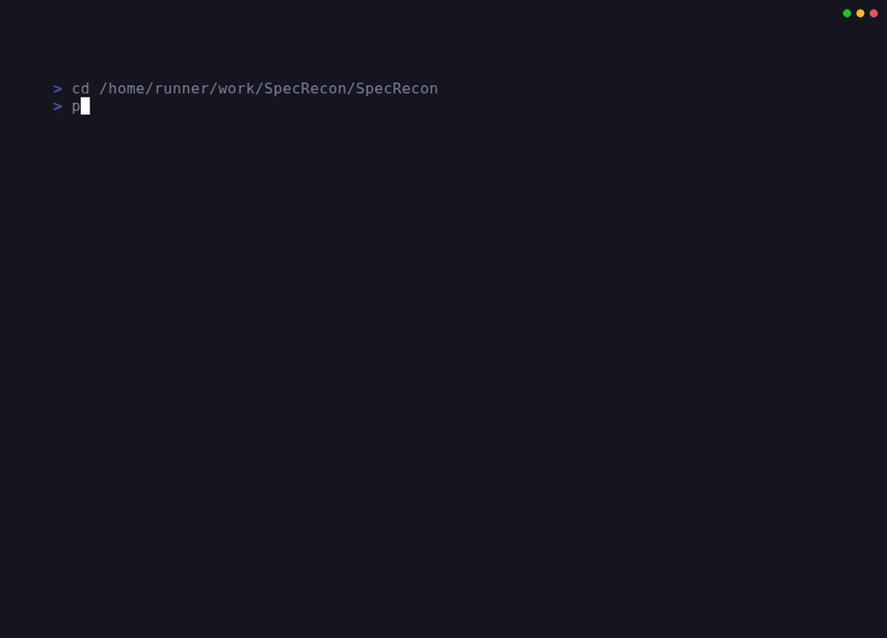
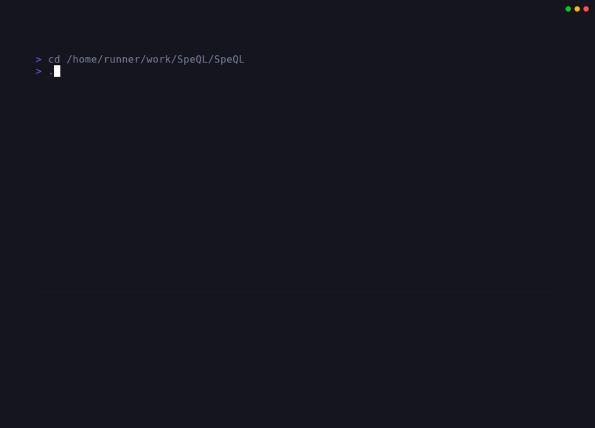

# SpeQL - API Spec Query Analyser

SpeQL is an API Spec Query Analyser that uses CodeQL to analyze API specifications. Currently supporting the Azure REST API, SpeQL is designed to identify APIs that might be vulnerable to SilentReaper. A SilentReaper vulnerability is characterized by emitting a SAS URI in API responses, which becomes dangerous when there is improper RBAC (Role-Based Access Control) or inadequate control/data plane isolation.

## Quick Start with CLI Menu

SpeQL now includes an interactive command-line menu system for easy navigation and execution of all available actions:

```bash
# Install dependencies (only pyfiglet needed for the CLI)
pip3 install -r requirements.txt

# Launch the interactive CLI menu
python3 SpeQL.py
```



The CLI menu provides:
- **Intuitive navigation** - Browse all actions organized by category
- **Interactive prompts** - Step-by-step guidance for complex operations
- **ASCII art logo** - Beautiful SpeQL branding using figlet
- **Comprehensive coverage** - Access to all documented scripts and tools
- **User-friendly** - Input validation and helpful error messages
- **Smart memory management** - Automatic CodeQL memory optimization for large databases

### CLI Menu Structure

- 📊 **Security Analysis** - Run security scans on Azure API specifications
- 🗄️ **Database Management** - Clone, update, and rebuild the CodeQL database
- 🔍 **CodeQL Security Queries** - Execute CodeQL queries and view results
- 📈 **SARIF Analysis Tools** - Analyze SARIF output for threat hunting
- ⚙️ **Setup and Installation** - Automated setup and dependency management
- 📚 **Documentation and Help** - Access guides and documentation
- ℹ️ **About SpeQL** - Learn about the tool and its capabilities

### Alternative: Command-Line Usage

For automation or scripting, you can still use the individual scripts directly:

```bash
# Run security analysis
python3 analyze.py

# Update database
python3 refresh_database.py

# Run CodeQL queries
./run-queries.sh
```

## Overview

SpeQL analyzes Azure REST API specification files (Swagger/OpenAPI) to identify potential security vulnerabilities. It includes:

- **Python Analyzer (analyze.py)**: Scans API schemas for multiple vulnerability types including SilentReaper patterns, Azure Vault Recon, missing access control, and insecure credentials
- **CodeQL Query (SasUriInResponse.ql)**: Detects Azure Shared Access Signature (SAS) tokens exposed in API example responses - a key indicator of SilentReaper vulnerabilities

## Vulnerabilities Detected

The Python analyzer (analyze.py) detects the following vulnerability types when analyzing API schema files:

### 1. Insecure Logic App Trigger (SilentReaper Pattern)

Detects Logic App HTTP triggers that can be invoked without authentication:
- Missing authentication configuration
- Weak authentication (None/Anonymous)
- Public HTTP endpoints without access control

**CWE References**: CWE-306 (Missing Authentication), CWE-862 (Missing Authorization)

### 2. Insecure Key Vault Configuration (Azure Vault Recon)

Identifies Key Vault misconfigurations that expose secrets:
- Missing network restrictions
- Public network access enabled
- Overly permissive access policies
- Embedded secrets instead of Key Vault references

**CWE References**: CWE-284 (Improper Access Control), CWE-522 (Insufficiently Protected Credentials)

### 3. Missing Access Control

Finds API endpoints without proper security:
- Sensitive operations (DELETE, CREATE, UPDATE) without authentication
- Endpoints with empty security arrays
- Public workflow access without restrictions

**CWE References**: CWE-284, CWE-862

### 4. Insecure Credentials

Locates hardcoded credentials and secrets:
- Connection strings with embedded passwords
- Hardcoded API keys and secrets
- Basic authentication with visible passwords
- Secure strings with default values

**CWE References**: CWE-798 (Hardcoded Credentials), CWE-259 (Hard-coded Password)

### 5. SAS URI Exposure in API Responses (CodeQL Query) - SilentReaper Vulnerability

The CodeQL query (SasUriInResponse.ql) detects Azure Shared Access Signature (SAS) URIs in API example responses, which is the hallmark of SilentReaper vulnerabilities:
- SAS tokens in response bodies (inputsLink, outputsLink, etc.)
- URIs containing signature parameters (sig, se, sp, sv)
- Control-plane APIs exposing data-plane access credentials
- Data exfiltration risks through exposed SAS tokens

**Why CodeQL for SAS URIs?**: API schema definitions don't contain actual SAS URIs - only API example response files do. This makes CodeQL database scanning ideal for finding real SAS URI exposures in example outputs.

**SilentReaper Vulnerability Definition**: A SilentReaper vulnerability occurs when an API emits a SAS URI in its response. This becomes dangerous when combined with improper RBAC (Role-Based Access Control) or inadequate control plane/data plane isolation, potentially allowing unauthorized access to Azure resources.

**Security Impact**: SAS URIs grant time-limited access to Azure resources. When exposed in control-plane API responses with improper RBAC or inadequate control/data plane isolation, they can enable unauthorized data-plane access and data exfiltration.

**CWE References**: CWE-200 (Exposure of Sensitive Information), CWE-359 (Exposure of Private Personal Information)

## Repository Structure

```
SpeQL/
├── README.md                    # This file
├── CONTRIBUTING.md              # Contributing guidelines
├── LICENSE                      # License information
├── setup.sh                     # Automated setup script
├── refresh-database.sh          # Bash script to refresh database
├── refresh_database.py          # Python script to refresh database
├── analyze.py                   # Python-based security analyzer (no dependencies!)
├── run-queries.sh              # CodeQL query execution script
├── config/
│   └── SpeQL.yml               # CodeQL database configuration
├── database/                   # CodeQL database (created by refresh scripts)
│   └── azure-api-db/           # CodeQL database of Azure API specs
├── docs/                       # Documentation
│   ├── CODEQL_WORKFLOW.md
│   ├── DATABASE_REFRESH.md
│   ├── EXAMPLE_OUTPUT.md
│   ├── QUICKSTART.md
│   ├── QUICK_REFERENCE.md
│   ├── REPOSITORY_STRUCTURE.md
│   └── SARIF_ANALYSIS_QUICKSTART.md
├── queries/
│   └── azure-security/         # Security query suite (CodeQL)
│       ├── SasUriInResponse.ql # Detects SAS URIs in API example responses
│       └── qlpack.yml          # Query pack dependencies
├── results/                    # Analysis results (generated)
├── scripts/
│   └── sarif-analysis/         # SARIF analysis and threat hunting tools
│       ├── deduplicate-by-product-operation.sh
│       ├── parse-sarif-endpoints.sh
│       ├── prioritize-threats.sh
│       └── README.md           # Detailed script documentation
├── tests/                      # Test scripts
│   ├── test_json_file_count_fix.sh
│   └── test_memory_management.sh
└── utils/                      # Utility scripts
    └── memory_utils.sh         # Memory management utilities
```

For a detailed explanation of the repository organization and recent changes, see [docs/REPOSITORY_STRUCTURE.md](docs/REPOSITORY_STRUCTURE.md).

## Smart Memory Management

SpeQL includes intelligent memory management for CodeQL query execution that automatically optimizes performance for large databases.

### Key Features
- **Automatic Detection**: Detects total system memory on Linux and macOS
- **Smart Optimization**: Applies memory limits (90% of total RAM) only for databases with >50K JSON files
- **Manual Override**: Set custom memory limits via environment variable or interactive menu
- **Zero Configuration**: Works automatically without user intervention

### Usage

**Automatic (Recommended)**:
```bash
./run-queries.sh  # Memory limits applied automatically when needed
```

**Custom Memory Limit**:
```bash
export CODEQL_MEMORY_LIMIT=4096  # Set to 4GB
./run-queries.sh
```

**Interactive Menu**:
```bash
python3 SpeQL.py
# Navigate to: CodeQL Queries → Run with Custom Memory Limit
```

For detailed information, see [docs/MEMORY_MANAGEMENT.md](docs/MEMORY_MANAGEMENT.md).

## Installation

### Quick Setup (Recommended)

Run the automated setup script to install all dependencies:

```bash
./setup.sh
```


This script will:
1. Check and install Java Development Kit (JDK) if needed
2. Download and install CodeQL CLI 2.20.2
3. Install all required CodeQL query pack dependencies
4. Verify the installation

After setup completes, you're ready to run security analysis!

### Manual Installation

If you prefer to install manually or the automated script doesn't work on your system:

#### 1. Java Development Kit (JDK)

CodeQL requires a Java Runtime Environment (JRE) or Java Development Kit (JDK) to run.

```bash
# Install OpenJDK (Ubuntu/Debian)
sudo apt-get update
sudo apt-get install openjdk-11-jdk

# Or use a newer version
sudo apt-get install openjdk-17-jdk

# Verify installation
java -version
```

**Note**: CodeQL 2.20.x works with JDK 11 or newer. Most systems will work with OpenJDK 11, 17, or 21.

#### 2. CodeQL CLI with JavaScript Libraries

**Important**: 
- CodeQL version 2.23.x and newer have compatibility issues with JSON-only database creation. Use version 2.20.1 or 2.20.2.
- You need the **CodeQL libraries**, which can be obtained using `codeql pack install`.
- **CRITICAL**: The qlpack.yml specifies javascript-all@~0.9.0 (version 0.9.x), which is compatible with CodeQL 2.20.2. Newer versions (2.x+) contain syntax that CodeQL 2.20.2 cannot parse.
- The lock file pins the exact version to 0.9.4.

```bash
# 1. Install CodeQL CLI 2.20.2
wget https://github.com/github/codeql-cli-binaries/releases/download/v2.20.2/codeql-linux64.zip
unzip codeql-linux64.zip
export PATH="$PATH:$(pwd)/codeql"

# 2. Install query pack dependencies
# This automatically downloads all required libraries including codeql/javascript-all
cd queries/azure-security
codeql pack install .
cd ../..

# 3. Verify installation
codeql version
ls ~/.codeql/packages/codeql/javascript-all/

# 4. Run the queries
./run-queries.sh
```

**How it works:**
- The `queries/azure-security/qlpack.yml` file declares a dependency on `codeql/javascript-queries`
- Running `codeql pack install` resolves and downloads all dependencies including:
  - `codeql/javascript-all` (the JavaScript standard library)
  - `codeql/javascript-queries` (standard JavaScript security queries)
  - All transitive dependencies (dataflow, concepts, util, etc.)
- Dependencies are installed to `~/.codeql/packages/` and automatically resolved by CodeQL

**Verification:**
```bash
# Verify CodeQL version
codeql version

# Verify libraries are installed
ls ~/.codeql/packages/codeql/javascript-all/

# Check pack dependencies were resolved
cat queries/azure-security/qlpack.lock.yml

# Run the queries
./run-queries.sh
```

#### 3. Azure REST API Specifications

The database should contain Azure API specs from the [azure-rest-api-specs](https://github.com/Azure/azure-rest-api-specs) repository. This is automatically handled by the database refresh scripts.

### Refreshing the Database

The repository includes scripts to build and refresh the database directly from the Azure REST API specifications:


#### Using the Bash Script (Linux/Mac):
```bash
# Update repository and rebuild database (default: Logic Apps specs)
./refresh-database.sh

# Fresh clone and rebuild
./refresh-database.sh --fresh

# Build database for specific Azure service (e.g., Key Vault)
./refresh-database.sh --path specification/keyvault

# Build database for all Azure specifications
./refresh-database.sh --all

# Just update the repo without rebuilding
./refresh-database.sh --skip-db-build
```

#### Using the Python Script (Cross-platform):
```bash
# Update repository and rebuild database
python3 refresh_database.py

# Fresh clone and rebuild
python3 refresh_database.py --fresh

# Build for specific service
python3 refresh_database.py --path specification/compute

# Build for all specifications
python3 refresh_database.py --all
```

**Note**: Building the database requires CodeQL CLI to be installed. To only update the repository without rebuilding, use the `--skip-db-build` flag.

## Usage

### Quick Start with Python Analyzer

The easiest way to run the security analysis is using the Python-based analyzer:

```bash
python3 analyze.py
```


This will:
1. Automatically extract Azure API specifications from the database
2. Analyze all JSON files for security vulnerabilities
3. Display a detailed report of issues found
4. Exit with code 1 if issues are found (useful for CI/CD)

**No additional dependencies required!** The Python analyzer works out of the box.

### Analyzing Different Scopes

The analyzer supports multiple modes for different use cases:

#### Default Mode: Database Analysis
```bash
# Analyze from pre-built database (fastest, ~309 files for Logic Apps)
python3 analyze.py

# Verbose mode shows file counts and available alternatives
python3 analyze.py --verbose
```

#### Direct Repository Analysis
```bash
# Analyze from full azure-rest-api-specs repository (~253,543 files)
python3 analyze.py --source azure-rest-api-specs/specification

# Analyze specific Azure service
python3 analyze.py --source azure-rest-api-specs/specification/keyvault
python3 analyze.py --source azure-rest-api-specs/specification/compute

# Analyze custom directory
python3 analyze.py --source /path/to/custom/specs
```

**Note**: To analyze the full repository, first clone it:
```bash
python3 refresh_database.py --all --skip-db-build
```

#### When to Use Each Mode

- **Database Mode** (default): Fast analysis of specific service (Logic Apps by default)
- **Full Repository**: Comprehensive security audit of all Azure services
- **Specific Service**: Focused analysis of one Azure service (Key Vault, Compute, etc.)
- **Custom Directory**: Analyze your own API specifications

### Advanced: Using CodeQL Queries

For more advanced analysis with CodeQL (requires CodeQL CLI):



#### Building Database for CodeQL Analysis

**Important**: CodeQL queries run against the database. To analyze different Azure services with CodeQL, build the database with the desired path first:

```bash
# Build database with Key Vault specs
python3 refresh_database.py --path specification/keyvault --fresh

# Build database with all Azure specs (comprehensive analysis)
python3 refresh_database.py --all --fresh

# Build database with specific service (Compute, Storage, etc.)
python3 refresh_database.py --path specification/compute --fresh
```

After building the database, run CodeQL queries against it:

#### Run All Queries:
```bash
./run-queries.sh
```

This will:
1. Run all security queries against the Azure API database
2. Generate SARIF format results in the `results/` directory
3. Display a summary of issues found

#### Run Individual Queries:
```bash
codeql database analyze database/azure-api-db \
    queries/azure-security/SasUriInResponse.ql \
    --format=sarif-latest \
    --output=results/SasUriInResponse.sarif
```

#### Complete Workflow Example


```bash
# 1. Build database with Key Vault specifications
python3 refresh_database.py --path specification/keyvault --fresh

# 2. Run CodeQL queries against the database
./run-queries.sh

# 3. (Optional) Run Python analyzer on the same scope
python3 analyze.py
```

### Viewing Results

Results from the Python analyzer are displayed in the console with colored output.

Results from CodeQL are saved in SARIF format (Static Analysis Results Interchange Format) and can be:
- Viewed in VS Code with the SARIF Viewer extension
- Uploaded to GitHub Advanced Security
- Processed with SARIF tools

### Analyzing SARIF Results for Threat Hunting

SpeQL includes specialized scripts for analyzing SARIF output files to identify control plane/data plane isolation issues. These tools help prioritize findings and identify SilentReaper vulnerability patterns - where APIs emit SAS URIs in responses combined with improper RBAC or inadequate control/data plane isolation.


#### Quick Start with SARIF Analysis

After running CodeQL queries, use these scripts to analyze the results:

```bash
# 1. Deduplicate findings by product + operation (ignore API versions)
./scripts/sarif-analysis/deduplicate-by-product-operation.sh \
    results/SasUriInResponse-results.sarif

# 2. Parse and extract detailed endpoint data
./scripts/sarif-analysis/parse-sarif-endpoints.sh \
    -f csv results/SasUriInResponse-results.sarif

# 3. Prioritize threats by severity (SilentReaper vulnerability patterns)
./scripts/sarif-analysis/prioritize-threats.sh \
    --threshold high results/SasUriInResponse-results.sarif
```

#### Available SARIF Analysis Tools

1. **deduplicate-by-product-operation.sh** - Removes duplicate findings across API versions
   ```bash
   # Get unique vulnerable patterns
   ./scripts/sarif-analysis/deduplicate-by-product-operation.sh \
       -f grouped results/SasUriInResponse-results.sarif
   ```

2. **parse-sarif-endpoints.sh** - Extract structured endpoint data in multiple formats
   ```bash
   # Export to CSV for spreadsheet analysis
   ./scripts/sarif-analysis/parse-sarif-endpoints.sh \
       -f csv -o endpoints.csv results/SasUriInResponse-results.sarif
   ```

3. **prioritize-threats.sh** - Prioritize findings based on control plane/data plane risks
   ```bash
   # Generate threat hunting report
   ./scripts/sarif-analysis/prioritize-threats.sh \
       -f markdown -o threat-report.md results/SasUriInResponse-results.sarif
   ```

See [scripts/sarif-analysis/README.md](scripts/sarif-analysis/README.md) for detailed documentation, examples, and integration guides.

#### Threat Hunting Workflow

1. **Run Security Analysis:**
   ```bash
   ./run-queries.sh
   ```

2. **Identify Unique Patterns:**
   ```bash
   ./scripts/sarif-analysis/deduplicate-by-product-operation.sh \
       -v results/SasUriInResponse-results.sarif
   ```

3. **Focus on Critical Threats:**
   ```bash
   ./scripts/sarif-analysis/prioritize-threats.sh \
       --threshold critical -v results/SasUriInResponse-results.sarif
   ```

4. **Export for Further Analysis:**
   ```bash
   ./scripts/sarif-analysis/parse-sarif-endpoints.sh \
       -f csv --include-lines results/SasUriInResponse-results.sarif > analysis.csv
   ```

## Database Management

### Building and Refreshing the Database

The SpeQL database can be built directly from the [Azure/azure-rest-api-specs](https://github.com/Azure/azure-rest-api-specs) repository using either the bash or Python refresh scripts.

#### Refresh Script Options

Both `refresh-database.sh` and `refresh_database.py` support the following options:

- `--fresh` or `-f`: Perform a fresh clone of the Azure repository (removes existing)
- `--update` or `-u`: Update existing repository clone (default)
- `--path PATH` or `-p PATH`: Specify which Azure service specifications to include
  - Examples: `specification/logic`, `specification/keyvault`, `specification/compute`
  - Default: `specification/logic` (Logic Apps)
- `--all` or `-a`: Include all Azure service specifications
- `--branch BRANCH` or `-b BRANCH`: Specify which branch to use (default: main)
- `--skip-db-build`: Only clone/update the repository without rebuilding the database
- `--clean`: Clean existing database before rebuild
- `--help` or `-h`: Show help message

#### Common Workflows

**Initial Setup:**
```bash
# Clone Azure specs and build database for Logic Apps
./refresh-database.sh
```

**Regular Updates:**
```bash
# Update to latest specs and rebuild
./refresh-database.sh --update
```

**Analyze Different Azure Services:**
```bash
# Build database for Key Vault APIs
./refresh-database.sh --path specification/keyvault --fresh

# Build database for multiple services
./refresh-database.sh --path specification/compute --fresh
```

**Working with Limited Resources:**
```bash
# Just update the repository without rebuilding (no CodeQL needed)
./refresh-database.sh --skip-db-build

# Build database later when CodeQL is available
./refresh-database.sh
```

**Comprehensive Analysis:**
```bash
# Build database with all Azure specifications (may take significant time/space)
./refresh-database.sh --all --fresh
```

#### Database Structure

After running the refresh script, the database structure will be:

```
database/azure-api-db/
├── codeql-database.yml    # Database metadata
├── src.zip                # Zipped source files (for analyze.py)
├── src/                   # Extracted source files
├── db-javascript/         # CodeQL database files
├── log/                   # Build logs
└── diagnostic/            # Diagnostic information
```

#### Troubleshooting

**Issue: CodeQL not found**
- Install CodeQL CLI from [GitHub releases](https://github.com/github/codeql-cli-binaries/releases)
- Add to PATH: `export PATH="$PATH:/path/to/codeql"`
- Or use `--skip-db-build` to only update the repository

**Issue: "Could not create access credentials" or SSL certificate errors during `codeql pack install`**

This occurs when CodeQL cannot verify SSL certificates when downloading dependencies. 

**CRITICAL: The only reliable solution is to fix the SSL certificate issue and use `codeql pack install`.**

Manual library download is strongly discouraged because:
- Libraries from GitHub may be incompatible with your CodeQL version
- Newer library syntax (like `?` optional chaining) causes "token recognition error"
- Version mismatches lead to compilation failures

**Recommended Solutions (in order):**
1. **Update system certificates** (Best solution):
   ```bash
   sudo update-ca-certificates
   # Then retry: cd queries/azure-security && codeql pack install
   ```

2. **Use newer Java version** with updated CA certificates:
   ```bash
   sudo apt-get install openjdk-17-jdk  # or openjdk-21-jdk
   # Then retry: cd queries/azure-security && codeql pack install
   ```

3. **Configure corporate proxy** if behind one:
   ```bash
   export HTTP_PROXY=http://proxy.example.com:8080
   export HTTPS_PROXY=http://proxy.example.com:8080
   # Then retry: cd queries/azure-security && codeql pack install
   ```

4. **Contact system administrator** to resolve certificate trust issues

**Issue: "token recognition error at: '?'" when running queries**

This error indicates incompatible CodeQL library versions. Common causes:
- **Wrong library version**: CodeQL is installing javascript-all 2.6.x instead of 0.9.x
- **Wildcard dependency**: Using `*` in qlpack.yml causes CodeQL to use the latest version
- **Manually installed libraries** from GitHub that are too new for CodeQL 2.20.2
- Libraries containing syntax (like `?` nullable types) that CodeQL 2.20.2 cannot parse
- Version mismatch between CodeQL CLI and library files

**Solution:**
1. Ensure you have the latest version of this repository:
   ```bash
   git pull origin main
   ```

2. Verify qlpack.yml has the correct version constraint:
   ```bash
   cd queries/azure-security
   grep javascript-all qlpack.yml
   # Should show: codeql/javascript-all: ~0.9.0 (NOT *)
   ```

3. Remove any existing libraries and lock file:
   ```bash
   rm -rf ~/.codeql/packages
   rm -f codeql-pack.lock.yml  # Force regeneration
   ```

4. Re-install with correct version:
   ```bash
   codeql pack install .
   ```

5. Verify the correct version is installed:
   ```bash
   ls ~/.codeql/packages/codeql/javascript-all/
   # Must show: 0.9.4 (not 2.6.18)
   ```

If it still installs 2.6.18, the qlpack.yml file has `*` instead of `~0.9.0`. Pull the latest changes or manually edit qlpack.yml.

6. If SSL issues cannot be resolved, consider upgrading to CodeQL 2.18+ which has better certificate handling

**Issue: "Could not resolve library path" errors**
- Run `codeql pack install` in the `queries/azure-security` directory
- Verify `~/.codeql/packages/codeql/javascript-all/` exists and contains the library files
- Check that library versions match the lock file requirements

**Issue: Clone/build takes too long**
- Use `--path` to target specific services instead of `--all`
- The default Logic Apps specification is much smaller than all specifications

**Issue: Out of disk space**
- Use sparse checkout (automatic with `--path`)
- Clean up old database with `--clean` before rebuild
- Avoid using `--all` unless necessary

## Query Details

### Python Analyzer (analyze.py)

The Python-based security analyzer provides comprehensive scanning of API schema files for multiple vulnerability types. It works standalone without CodeQL dependencies and is ideal for:
- Scanning API schema/specification files
- CI/CD integration
- Quick security assessments

**Vulnerability types detected:**
- **Insecure Logic App Triggers** (SilentReaper Pattern): HTTP/Request triggers missing or using weak authentication
- **Insecure Key Vault Configuration** (Azure Vault Recon): Key Vaults without network restrictions or with overly permissive access
- **Missing Access Control**: Sensitive operations without authentication requirements
- **Insecure Credentials**: Hardcoded passwords, API keys, and connection strings

### CodeQL Query: SasUriInResponse.ql

This CodeQL query detects Azure Shared Access Signature (SAS) URIs exposed in API example response files - the defining characteristic of SilentReaper vulnerabilities.

**What it detects:**
- SAS URIs in API response bodies containing signature tokens
- URIs with SAS parameters (sig, se, sp, sv) in response properties
- Control-plane APIs exposing data-plane access tokens
- Potential data exfiltration risks through exposed SAS tokens

**Why CodeQL for this?**: API schema definitions don't contain actual SAS URIs with signature tokens - only API example response files do. CodeQL database scanning is ideal for finding real SAS URI exposures in these example outputs.

**SilentReaper Vulnerability**: A SilentReaper vulnerability occurs when an API emits a SAS URI in its response. This becomes particularly dangerous when combined with improper RBAC (Role-Based Access Control) or inadequate control/data plane isolation.

**Security Impact:**
SAS tokens grant time-limited access to Azure resources. When control-plane APIs expose these tokens in responses with improper RBAC or inadequate control/data plane isolation, attackers can:
- Access storage accounts or other data-plane resources
- Exfiltrate sensitive data
- Bypass intended access controls

**References:**
- [Azure SAS Overview](https://learn.microsoft.com/en-us/azure/storage/common/storage-sas-overview)
- [Azure Silent Reaper Disclosure](https://cirriustech.co.uk/blog/azure-silent-reaper/)

## References

- [Azure Silent Reaper Vulnerability](https://cirriustech.co.uk/blog/azure-silent-reaper/)
- [Azure Vault Recon Vulnerability](https://cirriustech.co.uk/blog/azure-vault-recon/)
- [CodeQL Documentation](https://codeql.github.com/docs/)
- [Azure REST API Specifications](https://github.com/Azure/azure-rest-api-specs)

## Contributing

Contributions are welcome! Please submit pull requests with:
- New security queries for Azure misconfigurations
- Improvements to existing queries
- Additional test cases
- Documentation enhancements

## License

See LICENSE file for details.