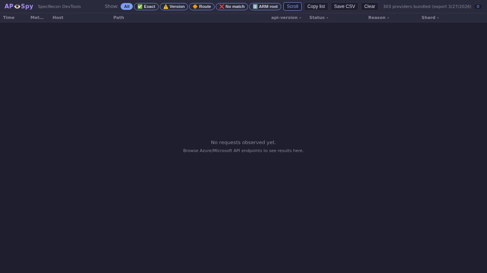
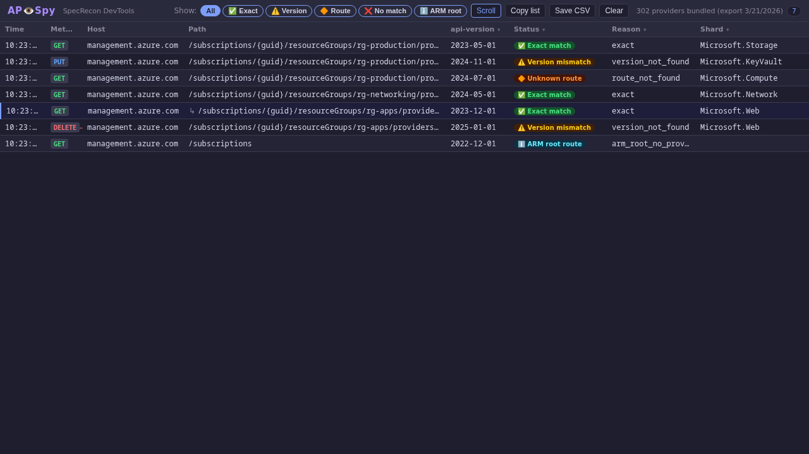
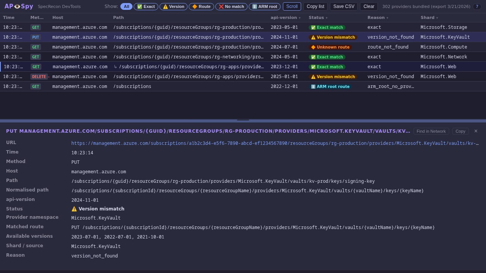

# AP👁️Spy — SpecRecon DevTools Extension

AP👁️Spy is the DevTools observer for **SpecRecon / SpeQL**.  
It adds a custom panel to Chromium-based browser developer tools that watches outgoing network requests and cross-references them against the bundled SpecRecon API inventory.

---

## What does it do?

For every Azure/Microsoft API request observed in the DevTools network inspector, APISpy classifies the request into one of five states:

| Status | Meaning |
|---|---|
| ✅ **Exact match** | Host + method + path template + `api-version` exist in the bundled index |
| ⚠️ **Version mismatch** | Route found, but the requested `api-version` is not in the spec |
| 🔶 **Unknown route** | Provider namespace is known; route not found in bundled shard |
| ❌ **No spec match** | No provider namespace inferred from the request URL |
| ℹ️ **ARM root route** | Valid ARM endpoint with no provider namespace (e.g. `/subscriptions`, `/tenants`) |

Requests with a recognised provider namespace, plus ARM root routes, are shown in the panel.  
Out-of-scope traffic (non-Azure/Microsoft hosts, URLs with no recognisable provider path) is silently dropped.

---

## Architecture

```
apispy/
├── extension/          ← The unpacked Chrome extension directory
│   ├── manifest.json   ← MV3 extension manifest
│   ├── devtools.html   ← DevTools page entry point (loads lib scripts for sweep processing)
│   ├── devtools.js     ← Registers the APISpy panel; full ARM processing during sweep mode
│   ├── panel.html      ← Panel UI markup
│   ├── panel.js        ← Panel logic: observation, rendering, filtering, standalone restore
│   ├── panel.css       ← Panel styles
│   ├── lib/
│   │   ├── filters.js      ← In-scope heuristics (host/URL based)
│   │   ├── normalizer.js   ← Extracts & normalises request fields
│   │   ├── loader.js       ← Lazy-loads provider shards from bundled data
│   │   └── matcher.js      ← Classifies requests against the index
│   ├── data/
│   │   ├── manifest.json   ← Lists bundled shards + source metadata
│   │   └── shards/         ← Per-provider minified JSON shard files
│   └── icons/
│       ├── icon16.png
│       ├── icon48.png
│       └── icon128.png
├── scripts/
│   ├── portal_sweep.py     ← Automated portal sweep (device code auth + Playwright)
│   ├── prepare_data.py     ← Extracts shards from the SpecRecon zip export
│   └── generate_screenshots.py  ← Generates demos/ screenshots of the extension
└── tests/
    ├── test_filters.js
    ├── test_normalizer.js
    └── test_matcher.js
```

---

## Automated Portal Sweep

`apispy/scripts/portal_sweep.py` automates a full Azure Portal sweep using
Playwright and the APISpy extension.  It authenticates via Azure device code
flow, visits every service on the **All Services** page, and exports all captured
ARM API calls as a CSV file.

**What it produces:**

- `apispy-TIMESTAMP.csv` — every matched ARM request observed across all 305 portal services
- `apispy-sweep-TIMESTAMP.webm` — full browser recording (with `--record-video`)
- `apispy-portal-sweep-browser.gif` — trimmed GIF demo of the browser sweep (if `ffmpeg` is on PATH)

**Quick start:**

```bash
pip install azure-identity playwright
python3 -m playwright install chromium

# Run the sweep (from the repository root)
python3 apispy/scripts/portal_sweep.py

# With browser video recording
python3 apispy/scripts/portal_sweep.py --record-video --output-dir ./results
```

**How sweep mode works:**

The sweep script sets `apispy_sweep_mode = '1'` in the browser's `localStorage`
before navigation begins.  `devtools.js` detects this flag and, for every ARM
request it intercepts, immediately runs the full Normalizer → Loader → Matcher
pipeline and stores a compact pre-processed entry in `apispy_sweep_entries`.
When the sweep finishes, the script opens `panel.html` in standalone mode; it
reads the pre-processed entries synchronously and renders them — no async shard
loading required.  The net effect is the same real-time processing quality as
normal interactive use, but fully automated.

> For full documentation see [`apispy/scripts/PORTAL_SWEEP.md`](../scripts/PORTAL_SWEEP.md).

---

## Screenshots

The following screenshots were captured automatically using the Playwright script
at `apispy/scripts/generate_screenshots.py` (headless Chromium, 1280×720).

### Empty state — waiting for requests



### Requests table — mixed classification results

The table shows observed requests spanning all five status types, including
an ARM batch sub-request (↳ row).



### Detail panel — selected row breakdown

Clicking any row opens the detail panel, which shows the full classification
breakdown: matched route key, available spec versions, provider namespace, and
reason code.



To regenerate these screenshots after making changes to the extension:

```bash
# Install dependencies (one-time)
pip install playwright
python3 -m playwright install chromium

# Regenerate — output goes to demos/
python3 apispy/scripts/generate_screenshots.py
```

---

## How to load in Chrome / Edge

1. Open **chrome://extensions** (or **edge://extensions**).
2. Enable **Developer mode** (toggle in the top-right corner).
3. Click **Load unpacked**.
4. Select the `apispy/extension/` directory.
5. Open DevTools on any page (**F12** or right-click → *Inspect*).
6. You should see a new **APISpy** tab in the DevTools panel bar.
7. Browse to a page that makes Azure/Microsoft API calls and watch results appear.

---

## Panel features

### Status filter pills

The toolbar contains multi-select filter pills: **All** · **✅ Exact** · **⚠️ Version** · **🔶 Route** · **❌ No match** · **ℹ️ ARM root**.  
Each pill can be toggled independently to show only the desired classification(s).  Clicking **All** resets all filters.

### ARM batch inspection

`POST management.azure.com/batch` requests are automatically unpacked.  Each sub-request in the batch body is classified independently and shown as an indented `↳` row beneath the parent entry.

### Autoscroll

The **Scroll** button in the toolbar toggles autoscroll.  When enabled, the panel automatically scrolls to the newest row as requests arrive.

### Clear

The **Clear** button in the toolbar removes all observed requests from the panel, resetting the display to the empty state.

### Column-level filters

Each table column header (Method, api-version, Status, Reason, Shard) has a **▾** button that opens a per-column value picker.  Selecting a subset of values restricts the table to rows that match all active column filters simultaneously.  An active column filter highlights the column's **▾** button.  Column filters compose with the status filter pills — only rows satisfying both are shown.

### Detail panel and draggable divider

Selecting any row opens a detail panel below the request list.  The divider bar at the top of the detail panel can be dragged up or down to resize the split.

### Copy to clipboard

- **Copy list** (toolbar) — copies all currently visible rows as tab-separated values (TSV).
- **Copy** (detail panel toolbar) — copies the selected entry's details to the clipboard.

### Save CSV

**Save CSV** (toolbar) downloads all recorded requests as a quoted CSV file with 16 columns, suitable for offline analysis.

### URL deep link

The full request URL is shown as a clickable link in the detail panel and is included in both CSV and clipboard exports.

### Find in Network

The **Find in Network** button in the detail panel toolbar copies the request URL to the clipboard and displays guidance:  
> *URL copied — open the Network panel, press Ctrl+F (Windows/Linux) or Cmd+F (macOS) and paste to locate this entry.*

### Shard load error surfacing

If a provider shard fails to load at runtime, the affected entry is shown as a red **Load error** row in the detail panel, with `reason: "shard_load_failed"` and an `error` field describing the cause.

---

## How the static bundled index works

The extension ships with pre-extracted shard files in `data/shards/`.  
These are `.min.json` files derived from the SpecRecon grouped/sharded export
(`api-index-grouped.json`, schema 3.0.0), one file per Azure provider namespace.

A top-level `data/manifest.json` is read once on startup.  When a request arrives
for a provider like `Microsoft.Storage`, only the `Microsoft.Storage.min.json`
shard is fetched — nothing else is loaded.  Shard lookup tries an exact-case match
first, then falls back to a case-insensitive search.

All 302 available provider shards are bundled; there is no size cap.

### Re-bundling shards

To re-populate from a fresh SpecRecon export:

```bash
# From the repository root — requires the sharded zip in inventory/
python3 apispy/scripts/prepare_data.py --zip inventory/api-index-sharded-<run-id>.zip
```

To cap shard size (e.g. exclude shards larger than 100 KB):

```bash
python3 apispy/scripts/prepare_data.py --zip inventory/api-index-sharded-<run-id>.zip --size-limit 100
```

After running, reload the unpacked extension in Chrome to pick up the new data.

---

## Running the tests

The unit tests for `filters`, `normalizer`, and `matcher` run in Node.js (no
additional packages required).

```bash
# From the repository root
node apispy/tests/test_filters.js
node apispy/tests/test_normalizer.js
node apispy/tests/test_matcher.js
```

---

## Known limitations

- **Path template matching for non-ARM APIs.**  
  For Azure Resource Manager URLs the normalizer applies structural ARM rules:
  subscription/resource-group/tenant/location/management-group scope segments are
  replaced with canonical placeholders, and name-position segments within the
  provider resource path are replaced with `{name}`.  This significantly reduces
  false *Unknown route* results for ARM paths.  However, non-ARM API paths (e.g.
  Microsoft Graph `v1.0/…` paths) only receive basic normalisation (GUID and
  pure-integer segment replacement), so many Graph routes still appear as
  *Unknown route* even when the provider shard is bundled.

- **No background sync.**  
  The bundled index is a point-in-time snapshot.  There is no automatic update
  mechanism.

- **Graph and non-ARM APIs.**  
  `graph.microsoft.com` is recognised as in-scope, but the bundled index currently
  covers Azure Resource Manager (`management.azure.com`) exclusively.

---

## Future planned enhancements

1. **Remote artifact updates** — pull latest shards from GitHub Pages / artifact store.
2. **Graph API support** — add Microsoft Graph spec shards.
3. **Export timestamp display** — show index freshness in the panel.
4. **Filter persistence** — remember the last-used filter across panel opens.

---

## Relationship to SpecRecon / SpeQL

- **SpecRecon** — the repository and export pipeline that produces the API inventory.
- **SpeQL** — the query engine used to analyse the Azure REST API spec corpus.
- **APISpy** — this extension; the DevTools consumer of the SpecRecon static export.

APISpy does **not** modify the SpecRecon export pipeline.  It consumes the
already-produced output files.
